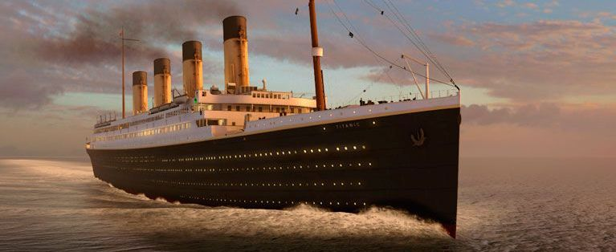

## Get Familiar with ML Basics in a Kaggle Competition: Titanic

This material was used in a Hands-on Guided Project at Coursera. It is aimed for beginner people into Machine Learning. 
The entire Coursera Guided Project is available in English, but soon it will also be available in Portuguese. 
